## About
Hewwo evewyone (づ ◕‿◕ )づ. I'm an active softwawe enginyeww student (◕ᗜ◕ ). I'm motivated and passionate in picking up new skills ( ◐ω◑)
and impwoving on my cuwwent skills UwU

## Heew is the tech that I cuwwently leawn

  
  
  
  
  
  
  
  
  
  
  

## Stats

  

  

